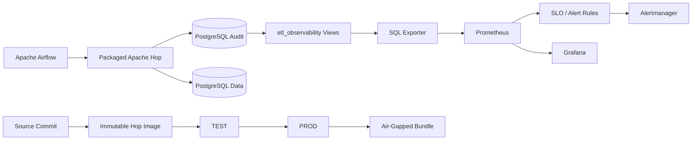

# Architecture / 架構

## 繁體中文

### v0.5 整體架構

### Observability boundary

Prometheus 不直接持有 PostgreSQL credential，也不直接執行 SQL。

責任切分：

| Component | Responsibility |
|---|---|
| PostgreSQL audit | execution truth / durable history |
| `etl_observability` | read-only aggregate surface |
| SQL Exporter | SQL → Prometheus exposition |
| Prometheus | scrape / TSDB / recording / alert evaluation |
| Alertmanager | routing baseline |
| Grafana | visualization |
| Airflow/Hop | orchestration / ETL execution |

### Read-only metrics surface

`003_v0_5_observability.sql` 建立：

- `etl_observability.pipeline_status_totals`
- `etl_observability.pipeline_runtime_metrics`
- sample monitor identity `etl_monitor`

Raw audit table 不需要直接暴露給 Grafana。

### SLO boundary

第一版 SLO：

`completed ETL success ratio >= 99%`

只有 `SUCCESS` / `FAILED` 進入 monotonic counter；`RUNNING` 狀態透過 gauge 觀察。

### Existing platform layers

v0.1–v0.4 能力仍保留：

- Airflow → Hop executable orchestration
- PostgreSQL retry-aware audit
- persisted ETL target
- immutable image promotion
- signed/checksummed Air-Gapped bundle

## English

v0.5 adds a read-only observability boundary between PostgreSQL audit data and the monitoring stack.

SQL Exporter converts aggregate PostgreSQL views into Prometheus metrics. Prometheus owns time-series storage, SLO recording rules, and alert evaluation; Alertmanager owns routing baseline; Grafana owns visualization.

Only final SUCCESS/FAILED attempts are represented as monotonic run counters. RUNNING health is exposed as gauges such as stale execution count.

The v0.1–v0.4 orchestration, audit, persistence, immutable promotion, and air-gapped layers remain intact.
