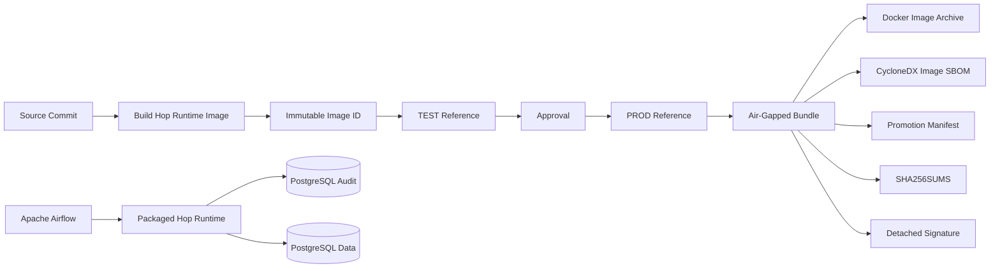

# Architecture / 架構

## 繁體中文

### v0.4 整體架構

### Build artifact boundary

v0.4 的 Apache Hop project 不再依賴 Compose bind mount 作為主要 runtime artifact。

`docker/hop-runtime.Dockerfile` 將 project bake 到：

`/opt/enterprise-etl/project`

環境差異仍由外部 Hop Environment file 提供，因此：

- Code / pipeline / metadata 屬於 immutable image。
- Endpoint / credential / environment variable 屬於 runtime configuration。
- PROD promotion 不重新 build image。

### Promotion identity

CI 使用 Docker image ID：

`sha256:...`

驗證 Candidate、TEST、PROD 為同一 artifact。

正式 Registry 應改用 registry digest：

`repository/image@sha256:...`

作為跨環境 promotion identity。

### ETL execution boundary

v0.3 能力保持不變：

- Airflow：schedule / retry / run identity。
- Hop：ETL execution。
- PostgreSQL：execution audit + persisted target。
- `run_id + attempt_number + correlation_id`：execution-to-data traceability。

### Offline deployment boundary

Air-Gapped bundle 只攜帶：

- immutable image archive
- SBOM
- manifest
- checksums
- signatures

真實 Credential 不進 bundle，由目標環境自行注入。

## English

v0.4 adds a software-supply-chain layer around the existing audited ETL runtime.

The Apache Hop project is baked into the runtime image at `/opt/enterprise-etl/project`, while environment-specific endpoints and credentials remain external runtime configuration.

CI proves candidate, TEST, and PROD references resolve to the same immutable Docker image ID. A production registry should use the registry digest as the authoritative promotion identity.

The air-gapped bundle contains the image archive, CycloneDX SBOM, promotion manifest, checksums, and detached signatures; it never contains real production credentials.
