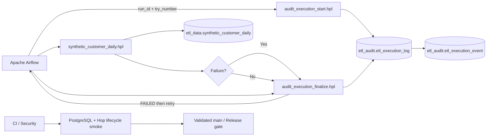

# Architecture / 架構

## 繁體中文

### v0.3 執行架構

### 責任分工

| Component | v0.3 Responsibility |
|---|---|
| Apache Airflow | Orchestration、retry、run identity、attempt identity |
| Hop Server | Authenticated execution endpoint |
| Hop audit pipelines | PostgreSQL lifecycle insert/update |
| Hop data pipeline | Synthetic ETL persistence |
| PostgreSQL Audit | Execution attempts + lifecycle events |
| PostgreSQL Data | Persisted synthetic ETL target |
| DB Trigger | `finished_at` 與 append-only lifecycle event |
| CI | 實際驗證 failed attempt + successful retry + target rows |
| Security | Secret Scan、Trivy、SBOM |

### Correlation model

三層共用：

- `run_id`
- `attempt_number`
- `correlation_id`

Airflow retry 不修改舊 attempt，而是建立新 attempt。Target data 也保存 attempt identity，因此能做 execution-to-data traceability。

### Database boundary

Hop 的 `audit-postgres` metadata 只保存 variable expressions：

- `${POSTGRES_HOST}`
- `${POSTGRES_PORT}`
- `${POSTGRES_DB}`
- `${POSTGRES_USER}`
- `${POSTGRES_PASSWORD}`

Repository 不保存真實 database endpoint 或 credential。

### 版本邊界

v0.3 不處理 immutable container image build/promotion、offline image archive、checksum/signing；這些屬於 v0.4。

## English

### v0.3 execution architecture

Airflow owns orchestration and retry identity. Hop Server executes dedicated audit-start, data-load, and audit-finalize pipelines. PostgreSQL stores one execution row per attempt, append-only lifecycle events, and persisted synthetic target rows.

`run_id`, `attempt_number`, and `correlation_id` form the cross-layer correlation contract. A retry creates a new attempt rather than overwriting the failed attempt.

The Hop PostgreSQL connection is environment-agnostic and stores variable expressions only; real endpoints and credentials are injected at runtime.

Immutable image build/promotion and offline image packaging remain v0.4 scope.
