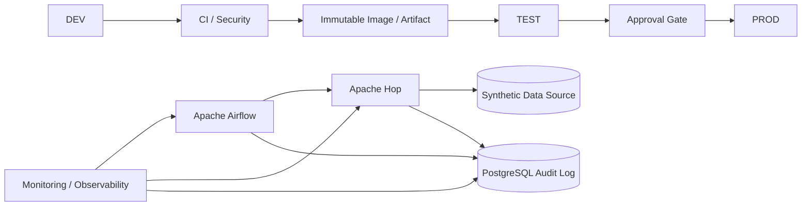

# Architecture / 架構

## 繁體中文

### 目標

v0.1 建立 Data Engineering Platform 的責任邊界：**Apache Hop 負責 ETL pipeline/workflow，Apache Airflow 負責 orchestration，PostgreSQL 保存 Audit / ETL Execution Log**，而 CI/CD 與 Security 控制 artifact promotion。

### 核心責任

| Component | Responsibility |
|---|---|
| Apache Hop | Pipeline / workflow execution |
| Apache Airflow | Scheduling, dependencies, retry, orchestration |
| PostgreSQL | ETL execution audit and operational metadata |
| Docker / Compose | Reproducible runtime baseline |
| CI / Security | Validation, secret scan, Trivy, SBOM |
| Promotion | DEV → TEST → PROD without rebuilding |
| Offline bundle | Approved image/SBOM/config transfer into Air-Gapped environment |

### 與其他作品的區隔

本專案不負責 RAG、LLM reasoning、MCP tool integration 或 model routing。這些能力可以成為上游/旁路整合，但 Data Engineering lifecycle 才是本 Repository 主角。

## English

### Goal

v0.1 establishes the responsibility boundary of the Data Engineering Platform: **Apache Hop owns ETL pipeline/workflow execution, Apache Airflow owns orchestration, PostgreSQL stores Audit / ETL Execution Logs**, while CI/CD and security controls govern artifact promotion.

The architecture above intentionally keeps RAG, LLM reasoning, MCP tool integration, and model routing outside the core platform boundary. Those capabilities may integrate later, but the Data Engineering lifecycle remains the primary concern of this repository.
