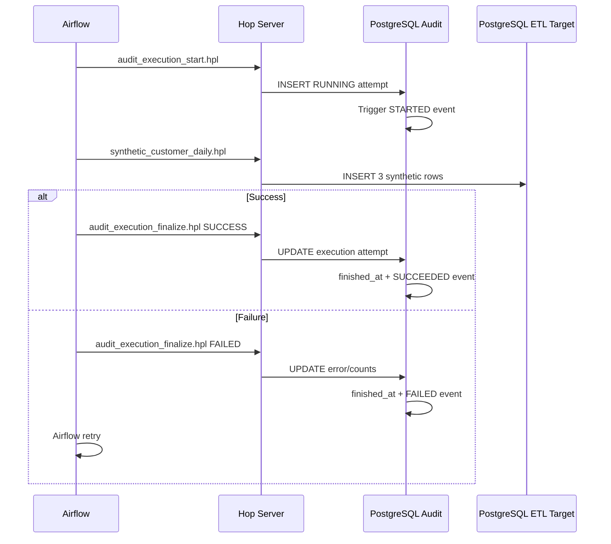

# Audit Lifecycle / ETL 稽核生命週期

## 繁體中文

### 目的

v0.3 將 ETL 執行從「知道成功或失敗」提升成可追蹤 **DAG Run、Retry Attempt、資料寫入與錯誤狀態** 的 PostgreSQL audit model。

### 資料模型

#### `etl_audit.etl_execution_log`

每一個 Airflow task attempt 對應一筆 execution row。

| Column | Purpose |
|---|---|
| `execution_id` | PostgreSQL surrogate key |
| `pipeline_name` | Hop pipeline logical name |
| `environment_name` | DEV / TEST / PROD |
| `run_id` | Airflow DAG run identifier |
| `correlation_id` | 跨 Airflow / Hop / target data 的關聯鍵 |
| `attempt_number` | Airflow `try_number` |
| `trigger_type` | MANUAL / SCHEDULED / CI / generic runtime type |
| `status` | RUNNING / SUCCESS / FAILED |
| `started_at` | attempt 開始時間 |
| `finished_at` | SUCCESS/FAILED 時由 DB trigger 寫入 |
| `records_read` | 本次 attempt 處理筆數 |
| `records_written` | 本次 attempt 寫入筆數 |
| `error_message` | 失敗摘要，不放 Credential 或完整 payload |

唯一鍵：

`pipeline_name + environment_name + run_id + attempt_number`

因此 retry 不會覆蓋前一個失敗 attempt。

#### `etl_audit.etl_execution_event`

Append-only lifecycle event，由 PostgreSQL trigger 自動建立：

`STARTED → SUCCEEDED`

或：

`STARTED → FAILED → retry attempt → STARTED → SUCCEEDED`

#### `etl_data.synthetic_customer_daily`

v0.3 的 persisted synthetic ETL target。每筆資料保留：

- `run_id`
- `attempt_number`
- `record_id`
- `correlation_id`
- synthetic business fields
- `loaded_at`

因此可以由 target row 回查產生它的 execution attempt。

### Runtime lifecycle



### Retry example

第一次：

```text
attempt_number = 1
status = FAILED
records_written = 0
error_message = synthetic retry validation
```

第二次：

```text
attempt_number = 2
status = SUCCESS
records_written = 3
```

兩筆 execution 都保留，不做 overwrite。

### 查詢範例

最近執行：

```sql
SELECT
    pipeline_name,
    environment_name,
    run_id,
    attempt_number,
    status,
    records_written,
    started_at,
    finished_at
FROM etl_audit.etl_execution_log
ORDER BY started_at DESC;
```

查看 retry：

```sql
SELECT
    run_id,
    attempt_number,
    status,
    error_message
FROM etl_audit.etl_execution_log
WHERE correlation_id = 'hop_synthetic_customer_daily:synthetic-example-run'
ORDER BY attempt_number;
```

由 target 回查 execution：

```sql
SELECT
    d.record_id,
    d.amount,
    l.status,
    l.started_at,
    l.finished_at
FROM etl_data.synthetic_customer_daily d
JOIN etl_audit.etl_execution_log l
  ON l.run_id = d.run_id
 AND l.attempt_number = d.attempt_number
WHERE d.run_id = 'synthetic-example-run';
```

所有範例值皆為 synthetic / generic。

## English

### Purpose

v0.3 introduces a PostgreSQL audit model that correlates Airflow DAG runs, retry attempts, Apache Hop execution, persisted ETL rows, and failure state.

### Data model

`etl_audit.etl_execution_log` stores one row per Airflow task attempt. The unique execution identity is `pipeline_name + environment_name + run_id + attempt_number`, so retries never overwrite previous failures.

`etl_audit.etl_execution_event` is an append-only lifecycle stream generated by PostgreSQL triggers. Normal execution produces `STARTED → SUCCEEDED`; retry scenarios preserve `STARTED → FAILED` for one attempt and a new `STARTED → SUCCEEDED` sequence for the next.

`etl_data.synthetic_customer_daily` is the persisted synthetic target and carries `run_id`, `attempt_number`, and `correlation_id` so target rows can be traced back to the execution that produced them.

### Operational rule

Error messages are summaries only. Credentials, tokens, real customer data, and full sensitive payloads must not be written to the audit tables.

The SQL examples above use synthetic identifiers only.
