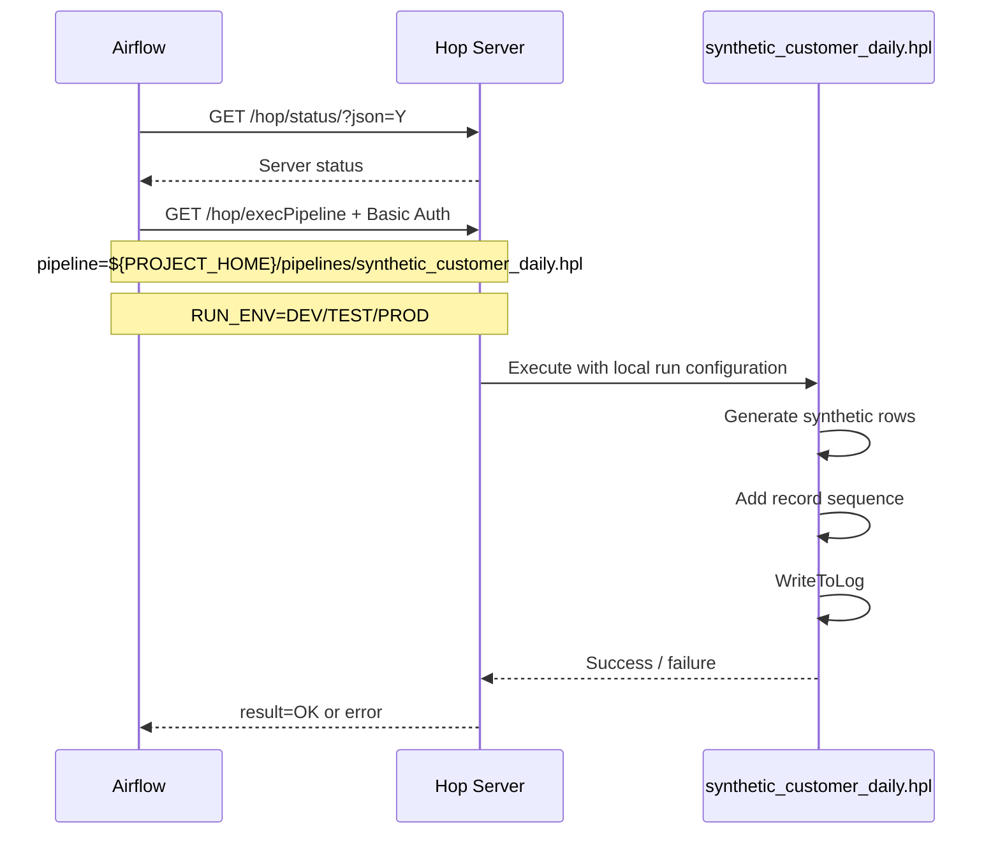

# Orchestration / 排程與整合

## 繁體中文

### v0.2 目標

v0.2 的核心不是讓 Airflow 自己做 ETL，而是建立清楚的責任分工：

- **Airflow**：排程、retry、dependency、runtime parameter、execution state。
- **Hop Server**：提供 authenticated execution endpoint。
- **Apache Hop pipeline**：執行 data processing。
- **PostgreSQL**：保留 audit schema；完整 execution persistence 在 v0.3。

### Runtime sequence



### Airflow DAG

檔案：

`airflow/dags/hop_synthetic_customer_pipeline.py`

DAG ID：

`hop_synthetic_customer_daily`

Task：

1. `check_hop_server`
2. `execute_hop_pipeline`

Hop Server 呼叫使用 Python standard library，不需要額外 Airflow HTTP/Docker provider，也不需要把 Docker socket 掛進 Airflow。

### Hop pipeline

檔案：

`hop/projects/enterprise-etl/pipelines/synthetic_customer_daily.hpl`

Transforms：

`RowGenerator → Sequence → WriteToLog`

Parameter：

`RUN_ENV`

此 pipeline 刻意不寫入正式 target table。v0.2 驗證的是 **orchestration contract 與 executable runtime path**；資料持久化與 PostgreSQL audit correlation 在 v0.3。

### Local test

```bash
make hop-smoke
```

Smoke test 會：

1. 啟動 temporary Hop Server。
2. 使用 synthetic Basic Auth credential。
3. 等待 `/hop/status` ready。
4. 呼叫 `/hop/execPipeline`。
5. 傳入 `RUN_ENV=CI`。
6. 驗證 JSON response 的 `result=OK`。
7. cleanup container。

### Docker Compose

```bash
docker compose --profile orchestration up -d
```

Airflow container 內：

- `HOP_BASE_URL=http://hop:8181`
- `HOP_PIPELINE_PATH=${PROJECT_HOME}/pipelines/synthetic_customer_daily.hpl`
- `PLATFORM_ENV=DEV`

Airflow 將 `PLATFORM_ENV` 轉成 Hop parameter `RUN_ENV`。

### Production considerations

正式環境應進一步：

- 用 Secret manager 注入 Hop credential。
- Hop Server 使用 private endpoint / network policy。
- 不受信任網段啟用 TLS。
- 將 execution correlation id 寫入 PostgreSQL audit。
- 將 Hop project 包成 immutable image，而不是直接 bind mount source。
- TEST 驗證後 promotion 同一 image digest 到 PROD。

## English

### v0.2 objective

The goal is not to make Airflow perform ETL itself. The responsibility split is explicit:

- **Airflow** owns scheduling, retries, dependencies, runtime parameters, and orchestration state.
- **Hop Server** exposes the authenticated execution endpoint.
- **Apache Hop pipelines** own data processing.
- **PostgreSQL** retains the audit schema; complete execution persistence is deferred to v0.3.

### Runtime sequence

Airflow checks Hop Server health, calls `/hop/execPipeline` with Basic Auth, passes `RUN_ENV`, and waits for the synchronous result. Hop executes `synthetic_customer_daily.hpl` with the local run configuration and returns success or failure.

### Why this pattern

The DAG uses only Python standard-library HTTP support. It requires neither an Airflow Docker/HTTP provider nor a Docker socket mounted into the Airflow container. This keeps orchestration and execution runtimes separated.

### Validation

`make hop-smoke` starts a temporary Hop Server, executes the same pipeline through the same REST endpoint used by Airflow, validates `result=OK`, and removes the container.

### Production considerations

A production deployment should inject credentials from a secret manager, isolate Hop Server on a private network, use TLS across untrusted boundaries, persist execution correlation into PostgreSQL audit tables, package the Hop project in an immutable image, and promote the same tested image digest from TEST to PROD.
