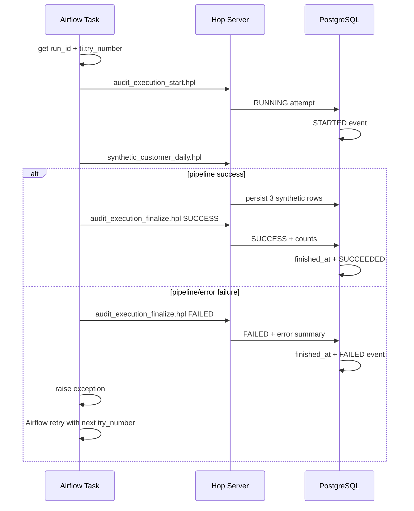

# Orchestration / 排程與整合

## 繁體中文

### v0.3 Orchestration contract

Airflow 不直接寫 PostgreSQL，而是 orchestrate 三個 Hop pipeline：

1. `audit_execution_start.hpl`
2. `synthetic_customer_daily.hpl`
3. `audit_execution_finalize.hpl`

這維持：

- Airflow = orchestration / retry identity
- Hop = data & database execution
- PostgreSQL = durable audit / target persistence

### Runtime sequence



### Airflow runtime identity

DAG：

`hop_synthetic_customer_daily`

Task：

`execute_etl_with_audit`

使用 Airflow Task SDK：

```python
context = get_current_context()
run_id = context["run_id"]
attempt_number = context["ti"].try_number
```

`correlation_id`：

```text
hop_synthetic_customer_daily:<run_id>
```

### Retry

`execute_etl_with_audit` 設定：

- retries: 2
- retry delay: 10 seconds

失敗時先盡力寫入 FAILED audit，再重新 raise exception，讓 Airflow 的 retry semantics 保持原生行為。

### Error handling

`error_message` 最長只取 1000 characters，避免將大量 response/payload 放進 audit table。正式環境仍需避免 exception message 帶入 Credential。

### Pipeline parameters

共同：

- `RUN_ENV`
- `RUN_ID`
- `ATTEMPT_NUMBER`
- `CORRELATION_ID`

Start audit 另有：

- `TRIGGER_TYPE`

Finalize 另有：

- `FINAL_STATUS`
- `RECORDS_READ`
- `RECORDS_WRITTEN`
- `ERROR_MESSAGE`

## English

v0.3 keeps Airflow as the orchestration and retry-identity layer while Hop performs all PostgreSQL writes.

The Airflow task reads `run_id` and `ti.try_number`, creates a RUNNING audit attempt, executes the data pipeline, and finalizes SUCCESS or FAILED. Failures are audited before the exception is re-raised to Airflow, so the next retry receives a new attempt number.

The correlation ID is stable across all attempts of a DAG run, while the attempt number distinguishes individual retries.
